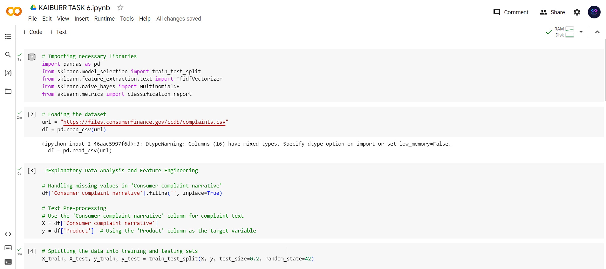

# Kaiburr

Kaiburr Assessment Tasks

## Tasks Completed

- [x] [Task 1. Java REST API]([Kaiburr-Tasks
/Task 1/](https://github.com/Pradeep-Kumar25th/Kaiburr-Tasks/tree/main/Task%201))
- [x] [Task 2. Swagger codegen]([[/Task 2](https://github.com/Pradeep-Kumar25th/Kaiburr-Tasks/tree/main/Task%202))
- [x] [Task 3. Docker compose]([/Task 3](https://github.com/Pradeep-Kumar25th/Kaiburr-Tasks/tree/main/Task%203))
- [x] [Task 4. WEB UI Forms]([/Task 4](https://github.com/Pradeep-Kumar25th/Kaiburr-Tasks/tree/main/Task%204))
- [x] [Task 6. Data Science example.
]([/Task 6](https://github.com/Pradeep-Kumar25th/Kaiburr-Tasks/tree/main/Task%206))

## High-level Directory Overview

imbipulkumar  
├───Kaiburr  
    ├───screenshots	//Tasks I/O Screenshots and GIF  
    ├───spring-server-generated //Task 2 Source Code and Documentation  
    ├───task1	//Task 1 Source Code and Documentation  
    ├───task3	//Task 3 Source Code and Documentation  
    ├───task4	//Task 4 Source Code and Documentation  
    └───README.md	//Brief Documentation

**NOTE**: *Task Building and Deployment steps along with screenshots are Documented inside respective folders*

## Application Architecture (3 Tier)

## Tech Stack

##### Frontend

- **Rect**

##### Backend
- **Spring Boot**
- **MongoDB**

##### DevOps
- **Maven**
- **NPM**
- **Git**
- **Docker**

##### *Production Deployment
- **AWS EC2**

## Task 1

**GOTO:**	[Task 1 Source Code and Documentation](/task1)

## Task 2

**GOTO:**	[Task 2 Source Code and Documentation](/spring-server-generated)

## Task 3

**GOTO:**	[Task 3 Source Code and Documentation](/task3)

## Task 4

**GOTO:**	[Task 4 Source Code and Documentation](/task4)

## Task 6
**GOTO:**   [Task 6 Source Code and Documentation]([/task6](https://github.com/Pradeep-Kumar25th/Kaiburr-Tasks/tree/main/Task%206))
  screenshots/Task 6 ss3.png
screenshots/Task 6 ss1.png

